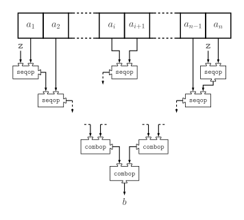

# Scala 常用函数

目录
=================
   * [a](#a)
      * [aggregate](#aggregate)
      * [andThen](#andthen)
      * [appended](#appended)
      * [appendedAll](#appendedall)
# a
## aggregate
```scala
trait IterableOnceOps[+A, +CC[_], +C] extends Any {
  @deprecated("`aggregate` is not relevant for sequential collections. Use `foldLeft(z)(seqop)` instead.", "2.13.0")
  def aggregate[B](z: => B)(seqop: (B, A) => B, combop: (B, B) => B): B = foldLeft(z)(seqop)
}
```
描述信息


```scal
//示例代码  
```
## andThen
## appended
## appendedAll
