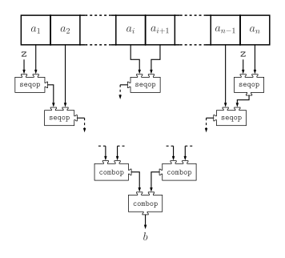

# Scala 常用函数

目录
=================

* [a](#a)
  * [aggregate](#aggregate)
  * [andThen](#andthen)
  * [appended](#appended)
  * [appendedAll](#appendedall)

# a

## aggregate

```scala
trait IterableOnceOps[+A, +CC[_], +C] extends Any {
  @deprecated("`aggregate` is not relevant for sequential collections. Use `foldLeft(z)(seqop)` instead.", "2.13.0")
  def aggregate[B](z: => B)(seqop: (B, A) => B, combop: (B, B) => B): B = foldLeft(z)(seqop)
}
```

`aggregate`将二元运算符应用于`seqop`元素块，然后使用二元运算符组合中间结果`combop`。该值`z`是该类型的零元素`B`，可以多次使用。



```scala
// 示例代码
// test pull
```

## andThen

## appended

## appendedAll
